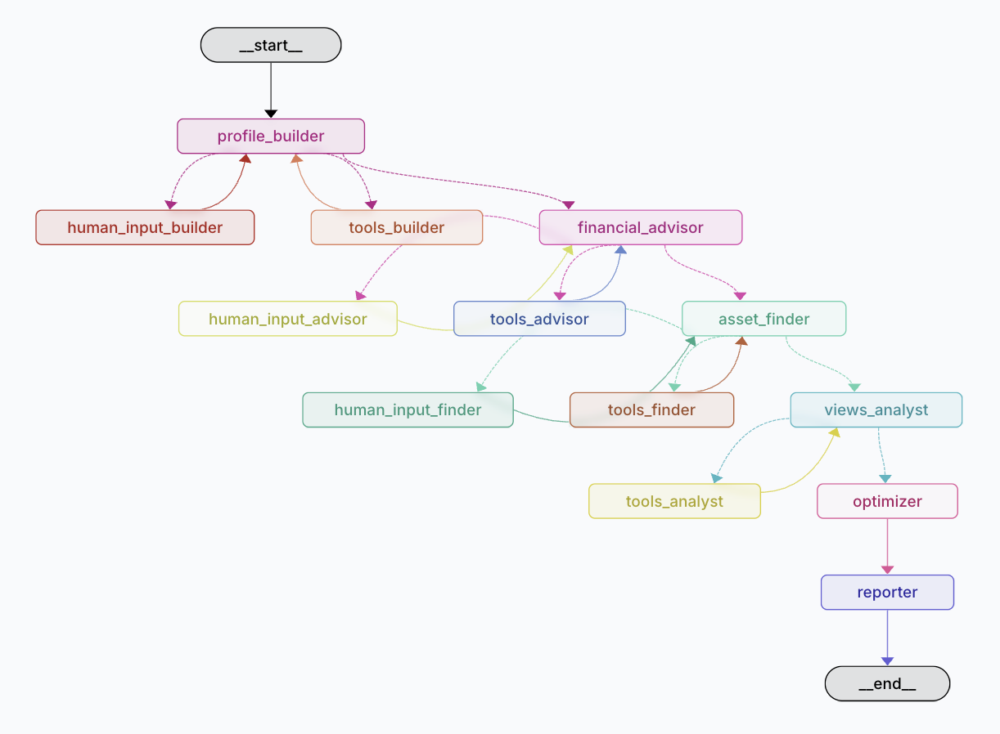

# Vibe Trader Agent

A sophisticated AI agent built with LangGraph that combines financial advisory capabilities with personalized user profiling. The agent uses a state-based graph architecture to manage conversations and provide tailored financial advice.



## Features

- **Interactive Profile Building**: Dynamically builds user profiles through natural conversation
- **Financial Advisory**: Provides personalized financial advice based on user profiles
- **Tool Integration**: Supports various tools for enhanced functionality
- **State Management**: Robust state management for maintaining conversation context
- **Interruptible Workflows**: Flexible conversation flow with support for tool interruptions

## Requirements

- Python 3.11 or higher
- OpenAI API key (or other supported LLM provider)
- Other dependencies as specified in `pyproject.toml`

## Installation

1. Clone the repository:
```bash
git clone https://github.com/yourusername/vibe-trader-agent.git
cd vibe-trader-agent
```

2. Setup Env and install Dependencies
```bash
./taskfile.sh setup_venv
```

3. Run application locally
```bash
./taskfile.sh run
```

## License

This project is licensed under the MIT License - see the [LICENSE](LICENSE) file for details.

## Acknowledgments

- Built with [LangGraph](https://github.com/langchain-ai/langgraph)
- Inspired by the need for personalized financial advisory systems

https://github.com/tevslin/meeting-reporter/blob/main/mm_agent.py

## Utils
### Google storage
Set google environmental variables for google, see example in .env.example

## How to use google cloud storage
```python 
from utils import init_storage_client, upload_pdf
import os
from dotenv import load_dotenv
load_dotenv('../../.env')

from io import BytesIO
from reportlab.pdfgen import canvas


def generate_pdf() -> bytes:
    """Generate a dummy PDF for example purposes."""
    buffer = BytesIO()
    pdf = canvas.Canvas(buffer)
    pdf.drawString(100, 100, "Generated PDF Content")
    pdf.save()
    pdf_bytes = buffer.getvalue()
    buffer.close()
    return pdf_bytes

# Initialize client
project_id = os.getenv('GOOGLE_CLOUD_PROJECT')
if not project_id:
    raise ValueError("GOOGLE_CLOUD_PROJECT environment variable is not set")

gcs_client = init_storage_client(project_id=project_id)
content_pdf_bytes = generate_pdf()

# Upload with signed URL (valid for 7 days)
url = upload_pdf(
    client=gcs_client,
    bucket='vibe-trader-reports-dev',
    destination="test_pdf.pdf",
    content=content_pdf_bytes,
    make_public=True,
    expiration_days=7
)
print(f"File uploaded successfully. Access URL: {url}")
```
Using this example u can upload any object converting into bytes stream.
If you specify make_public - as output you will get link to uploaded file.

## Questions and Support

> If you have any questions or need technical support, feel free to reach out.  
> You can contact me via [email](mailto:juliushaas91@gmail.com) or connect with me on [LinkedIn](https://www.linkedin.com/in/jh91/).
